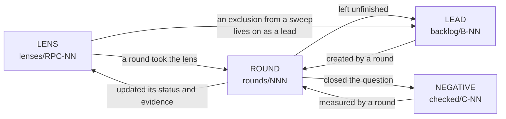

# Improvement-loop data

The way into this data: what lives where, how it is linked, and where to go
with a particular question.

**Navigation only.** The rules live in `../skills/improvement-loop/`: the
process in `SKILL.md`, the file schemas in `specs/`, the working methods in
`methods/`, the universal defect shapes in `catalog/`.

## Six entities

- **Lens** — what to look for, and how to find instances of it?
  `lenses/RPC-NN-*.md`, index [LENSES.md](lenses/LENSES.md)
- **Round** — what was done, with which numbers, and what proves it?
  `rounds/NNN-*.md`, index [ROUNDS.md](rounds/ROUNDS.md)
- **Lead** — what has not been done yet, and why?
  `backlog/B-NN-*.md`, index [BACKLOG.md](backlog/BACKLOG.md)
- **Negative** — what has been checked and must not be re-run?
  `checked/C-NN-*.md`, index [CHECKED.md](checked/CHECKED.md)
- **Bench** — what the measurement ran on, and what proves it can see the defect?
  `probes/P-NN-*.md`, index [PROBES.md](probes/PROBES.md)
- **Lesson** — what a round paid for, and where that rule was promoted?
  `lessons/L-NN-*.md`, index [LESSONS.md](lessons/LESSONS.md)

Plus [config.md](config.md) — this project's settings: toolchain, gate, probes,
severity bar, round cap, scope, standing owner requirements.

## How it is linked

The links run both ways, so from any record you can get back to the round that
produced it, and from a round to the numbers and the probe.

## Where to go with a question

- **"I want to run a round"** — [LENSES.md](lenses/LENSES.md) for a target,
  [BACKLOG.md](backlog/BACKLOG.md) for what is due,
  [CHECKED.md](checked/CHECKED.md) so nothing closed gets redone,
  [config.md](config.md) for the gate and the bar.
- **"What number is the next round"** — [ROUNDS.md](rounds/ROUNDS.md), the rule
  is written there.
- **"Has this been checked?"** — the lens status first: `swept here` means the
  sweep by its detector came back clean. Then
  [CHECKED.md](checked/CHECKED.md) — that holds what is not tied to a shape.
- **"Where did this claim come from"** — every record names its round; the round
  file carries the numbers, the probe and the outcome.
- **"What awaits me and what awaits the owner"** —
  [BACKLOG.md](backlog/BACKLOG.md), the status column.

## Where knowledge lives — one home per fact

Measured after round 234, because the answer had drifted: private memory held
52,203 words and this corpus 54,792 — two knowledge bases of the same size, and
the boundary between them was nowhere written down. It is not duplication;
`checked/` imported the pre-201 negatives, and the pre-201 SHAPES and METHODS
stayed outside, where nothing lints or ages them.

- **`.claude/loop/` owns everything measured about this code**: shapes (lenses),
  findings (rounds), open questions (leads), "checked, do not re-run"
  (negatives), benches, and lessons about working on this code. It is in git, it
  is checked by `loop.py lint`, and `stale` ages it against the paths it names.
  **A code fact that is not here cannot be routed to by `next`.**
- **`config.md` owns standing owner decisions and toolchain traps** the loop must
  obey — the gate, the cap, the severity bar, the launch traps.
- **Private memory owns the user**: preferences, feedback, how to work with this
  person. Nothing about what the code does.
- **The repo's `CLAUDE.md` owns durable facts for any contributor**: layout,
  commands, conventions.

The test when a fact could go in two places: **would a round need it to choose a
target or to measure?** Then it belongs here, whatever else also mentions it.

## What to trust with care

- **Rounds before 201 do not exist as files.** Their trace is in the git history
  (about 55 commits in one September run) and in private memory. References to
  them look like bare numbers, and that is correct: inventing a file that does
  not exist is not allowed.
- **Records marked `(not re-measured)`** were carried over from private memory
  and have not been reproduced in the current session.
- **Lens detectors have never been run** — they are search recipes, not results.
  The first round to take a lens sharpens them.
- **Everything ages, and separately**: a lead has its NUMBER and its BLOCKER, a
  lens has its status, a negative has its measurement. Re-measuring one's own
  record is a full round target, not a chore.

## What the lens set does not cover — curate pass after round 220

`loop.py stale` reports directories with no lens at all, and three whole layers
are in that list:

    packages/data/     108 files
    packages/blob/      76 files
    packages/notify/    50 files

Twenty rounds have mined core and the transports; nothing has ever looked at
these 234 files. That is not an accident of ranking — the lens set was derived
from the round history, which is almost entirely core and transports, so the set
cannot point at them. Deriving lenses for those layers is `B-10`, and it is a
`lenses`-mode job rather than a round.

Two lenses also have `applied: []` and a stated reason nobody takes them
(RPC-06 needs native toolchains, RPC-10 sits below the severity bar). Both are
written up in `lenses/LENSES.md` under "Nobody has taken these, and why", per
the curate rule that such a lens is either raised or given a reason.
