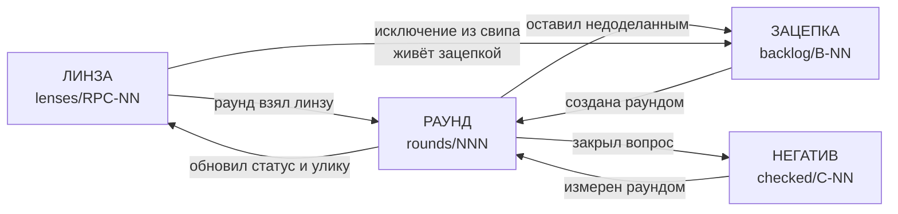

# Данные цикла улучшений

Вход в эти данные: что где лежит, как связано и куда идти с конкретным вопросом.

**Здесь только навигация.** Правила — в `../skills/improvement-loop/`: процесс в
`SKILL.md`, схемы файлов в `specs/`, методы работы в `methods/`, универсальные
формы дефектов в `catalog/`.

## Четыре сущности

- **Линза** — что искать и как найти экземпляры?
  `lenses/RPC-NN-*.md`, оглавление [LENSES.md](lenses/LENSES.md)
- **Раунд** — что было сделано, с какими числами и чем это доказано?
  `rounds/NNN-*.md`, оглавление [ROUNDS.md](rounds/ROUNDS.md)
- **Зацепка** — что ещё не сделано и почему?
  `backlog/B-NN-*.md`, оглавление [BACKLOG.md](backlog/BACKLOG.md)
- **Негатив** — что уже проверено и не надо перезапускать?
  `checked/C-NN-*.md`, оглавление [CHECKED.md](checked/CHECKED.md)

Плюс [config.md](config.md) — настройки этого проекта: тулчейн, гейт, пробы,
планка серьёзности, потолок раундов, область работ, постоянные требования
владельца.

## Как это связано

Ссылки двусторонние, поэтому от любой записи можно вернуться к раунду, который её
породил, а от раунда — к числам и пробе.

## Куда идти с вопросом

- **«Хочу прогнать раунд»** — [LENSES.md](lenses/LENSES.md) за целью,
  [BACKLOG.md](backlog/BACKLOG.md) за тем, что назрело,
  [CHECKED.md](checked/CHECKED.md) чтобы не переделывать закрытое,
  [config.md](config.md) за гейтом и планкой.
- **«Какой номер у следующего раунда»** — [ROUNDS.md](rounds/ROUNDS.md), правило
  написано там.
- **«Это уже проверяли?»** — сначала статус линзы: `исчерпана здесь` значит свип
  по её детектору прошёл чисто. Потом [CHECKED.md](checked/CHECKED.md) — там то,
  что не привязано к форме.
- **«Откуда взялось это утверждение»** — у каждой записи назван раунд; файл раунда
  несёт числа, пробу и результат канарейки.
- **«Что ждёт меня, а что владельца»** — [BACKLOG.md](backlog/BACKLOG.md), колонка
  статуса.

## Чему здесь верить с оглядкой

- **Раунды до 201 файлами не существуют.** Их след — в истории git (около 55
  коммитов за один сентябрьский прогон) и в приватной памяти. Ссылки на них
  выглядят как голые номера, и это правильно: выдумывать несуществующий файл
  нельзя.
- **Записи с пометкой `(не перепроверено)`** перенесены из приватной памяти и в
  текущей сессии не воспроизводились.
- **Детекторы линз ни разу не прогонялись** — это рецепты поиска, а не
  результаты. Первый раунд, взявший линзу, их уточняет.
- **Всё стареет, и по отдельности**: у зацепки её ЧИСЛО и её БЛОКЕР, у линзы её
  статус, у негатива его измерение. Перемер собственной записи — полноценная цель
  раунда, а не рутина.
