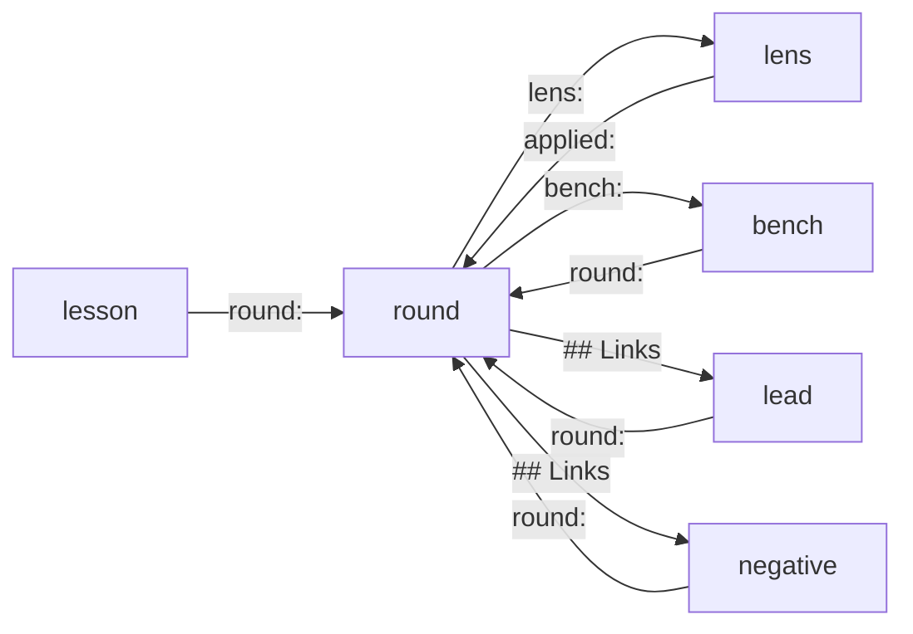

# Improvement-loop data

The way into this data: what lives where, how it is linked, and where to go
with a particular question.

**Navigation only.** The rules live in `../skills/evidence-loop/`: the
process in `SKILL.md`, the file schemas in `specs/`, the working methods in
`methods/`, the universal defect shapes in `catalog/`.

## Six entities, one directory each

- **Lens** — what to look for, and how to find instances of it?
  `lenses/RPC-NN-*.md`, ordered by `rank:`.
- **Round** — what was done, with which numbers, and what proves it?
  `rounds/NNN-*.md`.
- **Lead** — what has not been done yet, and why? `backlog/B-NN-*.md`, open
  ones ordered by `rank:`. A closed lead stays here with `status: closed`:
  it is the record that the question was answered.
- **Negative** — what has been checked and must not be re-run?
  `checked/C-NN-*.md`.
- **Bench** — what the measurement ran on, and what proves it can see the
  defect? `probes/P-NN-*.md`.
- **Lesson** — what a round paid for, and where that rule was promoted?
  `lessons/L-NN-*.md`.

There are no index files. The records are the only copy; `loop.py find`,
`status` and `next` read them.

Plus [config.md](config.md) — this project's settings: toolchain, gate, probes,
severity bar, round cap, scope, standing owner requirements.

## How it is linked

```mermaid
flowchart LR
    R[round] -->|lens:| L[lens]
    L -->|applied:| R
    R -->|bench:| P[bench]
    B[lead] -->|round:| R
    C[negative] -->|round:| R
    P -->|round:| R
    S[lesson] -->|round:| R
    R -->|## Links| B
    R -->|## Links| C
```

## Where to go with a question

- **Run a round** — `loop.py status`, then `next`, `find`, `brief`.
- **The next round's number** — `loop.py status`.
- **Has this been checked?** — `loop.py find <text>` or
  `loop.py find --path <file>`, and the `swept here` lens statuses.
- **Where a claim came from** — `loop.py find <ID>`; the round file carries the
  numbers, the probe and the outcome.
- **What awaits the owner** — `loop.py owner-review`.
- **What has aged against the code** — `loop.py stale`.
- **A ready bench for this surface** — `loop.py find --path <file> --kind probe`.
- **The order to take leads and lenses in** — `loop.py next`; to change it,
  `loop.py rank <ID> <POSITION>`.

## Where knowledge lives — one home per fact

- **`.claude/loop/` owns everything measured about this code**: shapes (lenses),
  findings (rounds), open questions (leads), "checked, do not re-run"
  (negatives), benches, and lessons about working on this code. It is in git,
  `loop.py lint` checks it, and `stale` ages it against the paths it names.
  **A code fact that is not here cannot be routed to by `next`.**
- **`config.md` owns standing owner decisions and toolchain traps** the loop must
  obey — the gate, the cap, the severity bar, the launch traps.
- **Private memory owns the user**: preferences, feedback, how to work with this
  person. Nothing about what the code does.
- **The repo's `CLAUDE.md` owns durable facts for any contributor**: layout,
  commands, conventions.

The test when a fact could go in two places: **would a round need it to choose a
target or to measure?** Then it belongs here, whatever else also mentions it.

## What to trust with care

- **Rounds before 201 do not exist as files.** Their trace is in the git history
  and in private memory. References to them look like bare numbers, and that is
  correct: inventing a file that does not exist is not allowed.
- **Rounds 251-265 have no files either.** They were one investigation, B-22,
  and their findings are in that lead,
  `backlog/B-22-paused-consumer-never-repays-the-pool.md`, which names
  them by number. The commits are in git.
- **Records marked `(not re-measured)`** were carried over from private memory
  and have not been reproduced since.
- **Lens detectors are search recipes, not results.** The first round to take a
  lens sharpens them.
- **Everything ages, and separately**: a lead has its number and its blocker, a
  lens has its status, a negative has its measurement. Re-measuring one's own
  record is a full round target, not a chore.
