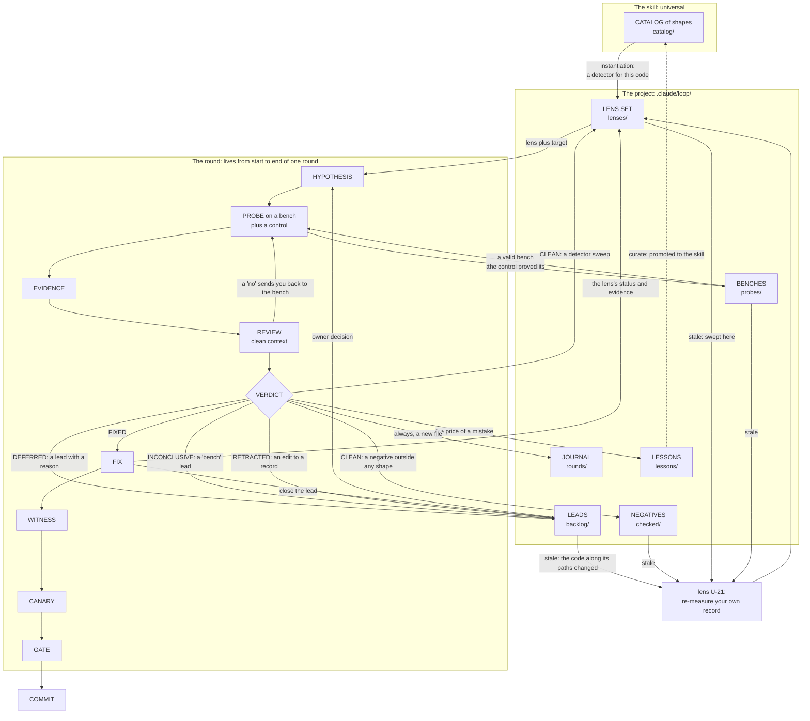
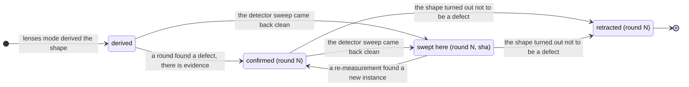

# The model: terms and how they relate

Read this on first contact, and whenever a term in a round feels uncertain.

## Terms of three kinds

Confusing the kinds is the main source of misunderstanding. An **entity** lives
between rounds in its own file. An **artefact** is created inside a round and
does not outlive it. A **procedure** is an action, not a thing.

Entities: a **lens** (a hypothesis generator: shape + detector + question +
paths + status; exactly one is applied per round), a **lead** (`backlog/` — the
unfinished, including a wait on the owner and a bench with no number), a
**negative** (`checked/` — an answered question: measured, clean), a **round**
(`rounds/` — recorded forever), a **bench** (`probes/` — a probe whose control
proved it sees the defect; reused), a **lesson** (`lessons/` — a rule for
working with this code that a round paid for).

Artefacts: a **hypothesis** (phrased so that it can fail to hold), a **probe** (a
program measuring one number; it becomes a bench once a control validates it), a
**control** (a second run with the suspected mechanism removed; without it the
number means nothing), **evidence** (a number; the only thing that outlives the
round — it moves into the lens, the journal and the commit), a **fix**, a
**witness** (a test that must fail before the fix), a **guard** (passes on both
sides: it pins, it does not prove), a **review** (a clean context's answers to
the questions in `review.md`), a **verdict**.

Procedures: **instantiate** (rewrite a universal shape's detector in terms of
this code), **sweep** (walk the whole list the detector produced), **canary**
(switch the fix off in place and confirm the witness fails), **gate** (run the
sequence of checks before the commit).

It reads as: **the catalog is not applied — a set is made from it; the set gives
a lens; a lens plus a target gives a hypothesis; a probe on a bench checks the
hypothesis; the bench is reused; the probe yields evidence; a review checks the
evidence; the evidence yields a verdict; the verdict decides what is recorded
and where; what is recorded ages and comes back in a later round; the price of a
mistake becomes a lesson.**

A **pack** is not a loop entity but a unit of knowledge: a damage vocabulary,
domain checklist items, reviewer questions, detectors. It lives in the skill
(`packs/`) or in the project (`.claude/loop/packs/`), is enabled by the config
and assembled by the script. The schema is `specs/pack.md`.

**The one-home rule.** Every fact has exactly one home; everywhere else there is
a link. A detector sweep lives on the lens; a negative outside any shape lives
in `checked/`; a round's numbers live in its file; a bench's validity lives on
the bench; a setting lives in the config; the next number lives nowhere and is
computed. A second copy of a fact will go stale silently.

## The links

Cardinality: a round has exactly one lens and exactly one verdict, but any
number of probes; a lens passes through many rounds over its life; a fix may
have several witnesses, and a fix in two halves must have two.

## A lens's lifecycle

INCONCLUSIVE does not change the status: the lens stays where it was, and a
"bench" lead remembers that the sweep did not happen.

The way out of `swept` and `confirmed` is always a re-measurement. **A status is
true for the set of places that existed on the day of the sweep** — which is why
the status stores a sha and `loop.py stale` compares the code along the lens's
paths against it. `retracted` is never deleted, or the shape will be derived
again.

**A lead has no cycle**: created by a round (DEFERRED or INCONCLUSIVE) -> sits
there with its number and its reason -> the number and the blocker age
separately -> the owner may write a decision -> re-measurement -> closed,
reduced, or found to be bigger than recorded.
