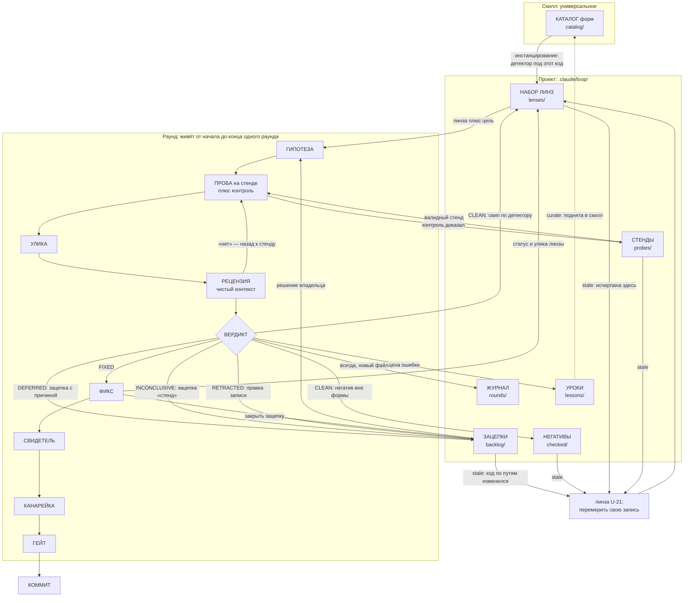
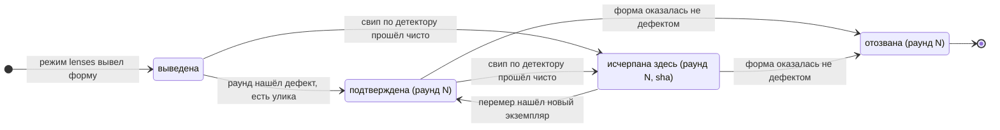

# Модель: термины и как они связаны

Читать при первом знакомстве и когда термин в раунде вызывает сомнение.

## Термины трёх родов

Путать роды — главный источник непонимания. **Сущность** живёт между раундами в
своём файле. **Артефакт** создаётся внутри раунда и дальше не живёт. **Процедура**
— действие, а не вещь.

Сущности: **линза** (генератор гипотез: форма + детектор + вопрос + пути +
статус; за раунд применяется ровно одна), **зацепка** (`backlog/` — недоделанное,
включая ожидание владельца и стенд без числа), **негатив** (`checked/` —
отвеченный вопрос: измерено, чисто), **раунд** (`rounds/` — записан навсегда),
**стенд** (`probes/` — проба, чей контроль доказал, что она видит дефект;
переиспользуется), **урок** (`lessons/` — правило работы с этим кодом, за которое
раунд заплатил).

Артефакты: **гипотеза** (формулируется так, чтобы могла не подтвердиться),
**проба** (программа, измеряющая одно число; стендом становится после
валидации контролем), **контроль** (второй запуск с убранным предполагаемым
механизмом; без него число не значит ничего), **улика** (число; единственное,
что переживает раунд — переезжает в линзу, журнал и коммит), **фикс**,
**свидетель** (тест, обязанный падать до фикса), **страж** (проходит с обеих
сторон: закрепляет, не доказывает), **рецензия** (ответ чистого контекста на
вопросы `review.md`), **вердикт**.

Процедуры: **инстанцировать** (переписать детектор универсальной формы в
терминах этого кода), **свип** (пройти весь список, который дал детектор),
**канарейка** (выключить фикс на месте и убедиться, что свидетель падает),
**гейт** (прогнать последовательность проверок перед коммитом).

Читается так: **каталог не применяют — из него делают набор; набор даёт линзу;
линза плюс цель дают гипотезу; гипотезу проверяет проба на стенде; стенд
переиспользуется; проба даёт улику; улику проверяет рецензия; улика даёт
вердикт; вердикт решает, что и куда записать; записанное стареет и возвращается
следующим раундом; цена ошибки становится уроком.**

**Пакет** — не сущность цикла, а единица знания: словарь ущерба, доменные пункты
чек-листов, вопросы рецензенту, детекторы. Живёт в скилле (`packs/`) или в
проекте (`.claude/loop/packs/`), подключается конфигом, собирается скриптом.
Схема — `specs/pack.md`.

**Правило одного дома.** У каждого факта ровно один дом; во всех остальных
местах — ссылка. Свип по детектору живёт на линзе; негатив вне формы — в
`checked/`; числа раунда — в его файле; валидность стенда — на стенде; настройка
— в конфиге; следующий номер — нигде, он вычисляется. Второй экземпляр факта
протухнет молча.

## Связи

Количества: раунд — ровно одна линза и ровно один вердикт, но сколько угодно
проб; линза за свою жизнь проходит через много раундов; у фикса может быть
несколько свидетелей, и у фикса из двух половин их обязано быть два.

## Жизненный цикл линзы

INCONCLUSIVE статус не меняет: линза остаётся там, где была, а зацепка «стенд»
помнит, что свип не состоялся.

Из `swept` и `confirmed` выход всегда через перемер. **Статус верен для того
множества мест, которое существовало на день свипа** — поэтому статус хранит sha,
а `loop.py stale` сравнивает код по путям линзы с этим sha. `retracted` не
удаляют — иначе форму выведут заново.

**Зацепка** цикла не имеет: создана раундом (DEFERRED или INCONCLUSIVE) -> лежит
со своим числом и причиной -> число и блокер стареют по отдельности -> владелец
может вписать решение -> перемер -> закрыта, уменьшена или оказалась больше, чем
записано.
