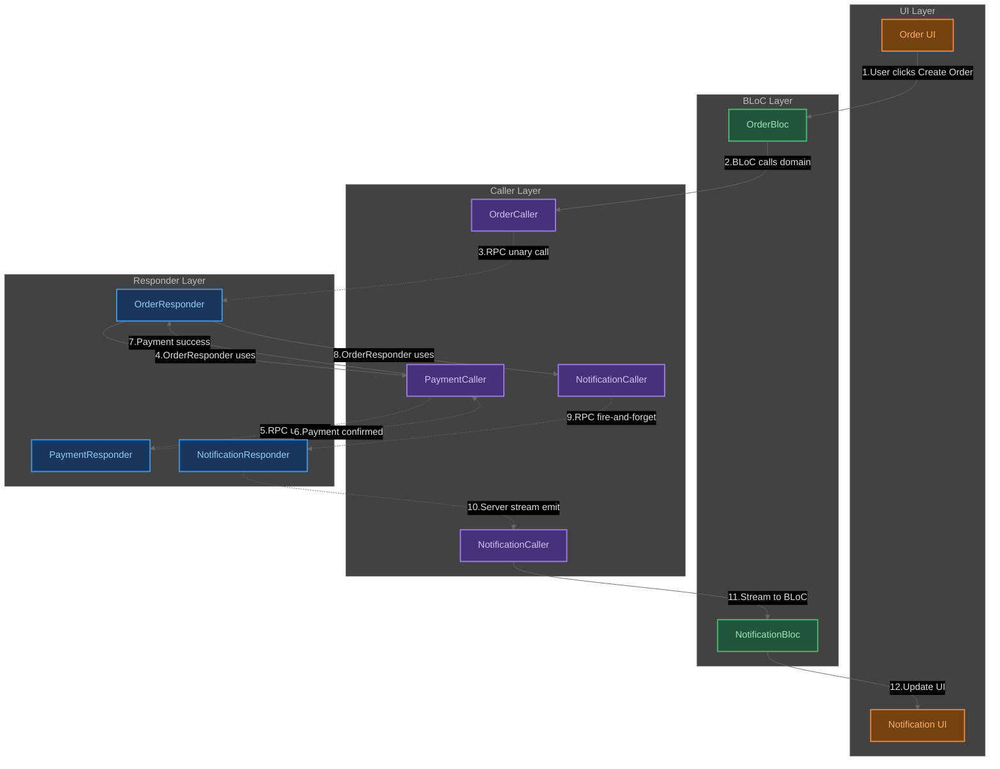

[](https://pub.dev/packages/rpc_dart)

# RPC Dart

> **Структурируйте большие Flutter приложения через изолированные домены с формальными контрактами**

RPC Dart — это библиотека для организации кода в больших Flutter приложениях через архитектурный подход **Backend-for-Domain (BFD)**. Она позволяет разделить приложение на независимые домены, которые взаимодействуют друг с другом через типобезопасные контракты.

## Архитектурный подход для больших Flutter приложений

RPC Dart реализует архитектурный паттерн **Backend-for-Domain (BFD)** — структурирование приложения через **независимые домены** с **типобезопасными контрактами**:

```dart
// Каждый домен работает изолированно через Caller'ы
class UserBloc extends Bloc<UserEvent, UserState> {
  final UserCaller _userService; // Только свой домен через Caller
  
  Future<void> updateProfile(UserProfile profile) async {
    final response = await _userService.updateProfile(
      UpdateProfileRequest(profile: profile),
    );
    emit(UserUpdated(response.user));
  }
}
```

## Ключевые компоненты

### Contract (Контракт)
Определяет API домена:

```dart
abstract interface class IUserContract implements IRpcContract {
  Future<UserResponse> getUser(GetUserRequest request);
  Future<UpdateProfileResponse> updateProfile(UpdateProfileRequest request);
}
```

### Responder (Реализация)
Содержит бизнес-логику домена:

```dart
final class UserResponder extends RpcResponderContract implements IUserContract {
  final UserRepository _repository;
  
  @override
  Future<UserResponse> getUser(GetUserRequest request) async {
    final user = await _repository.findById(request.userId);
    return UserResponse(user: user);
  }
}
```

### Caller (Клиент)
Вызывает методы домена:

```dart
final class UserCaller extends RpcCallerContract implements IUserContract {
  @override
  Future<UserResponse> getUser(GetUserRequest request) {
    return endpoint.unaryRequest<GetUserRequest, UserResponse>(
      serviceName: serviceName,
      methodName: 'getUser',
      requestCodec: GetUserRequest.codec,
      responseCodec: UserResponse.codec,
      request: request,
    );
  }
}
```

**Архитектурный принцип:**
- **Responder** получает Caller'ы других доменов в конструкторе
- **BLoC** получает Caller своего домена для обращения к нему  
- **UI** никогда не обращается к Responder'ам напрямую

## Архитектурная диаграмма



### 📖 Как читать диаграмму

Диаграмма показывает **конкретный сценарий** — пользователь создает заказ и получает уведомление:

**🔄 Пошаговый поток:**

1. **Пользователь нажимает "Создать заказ"** → Order UI
2. **UI передает событие** → OrderBloc  
3. **BLoC вызывает домен** → OrderCaller
4. **RPC запрос к OrderResponder** (unary call)
5. **OrderResponder обращается к платежам** → PaymentCaller
6. **RPC к PaymentResponder** (unary call)
7. **PaymentResponder подтверждает платеж** → PaymentCaller
8. **Успешный платеж возвращается** → OrderResponder
9. **Только после успешного платежа** → NotificationCaller (fire & forget)
10. **NotificationResponder стримит** → NotificationCaller (server stream)
11. **Уведомление попадает в UI** → NotificationBloc
12. **Пользователь видит уведомление** → Notification UI

### 📡 Real-time уведомления

Диаграмма показывает классический паттерн real-time уведомлений:

1. **OrderResponder** отправляет уведомление через `NC1` (NotificationCaller)
2. **NotificationResponder** получает уведомление и отправляет в real-time stream 
3. **NotificationBloc** подписывается на стрим через `NC2` (другой NotificationCaller)
4. **Notification UI** реактивно отображает новые уведомления

### 🔗 Типы RPC взаимодействий

Диаграмма показывает все основные типы RPC методов:

| Тип | Описание | Пример использования |
|-----|----------|---------------------|
| **unary call** | Запрос → Ответ | Обычные операции CRUD |
| **unary send** | Отправка без ожидания ответа | Fire-and-forget уведомления |
| **server stream subscribe** | Подписка на поток данных | Real-time обновления |
| **server stream emit** | Отправка потока данных | Live уведомления, чаты |

Это демонстрирует, как BFD поддерживает все паттерны RPC взаимодействий из современных фреймворков типа gRPC.

## Практический пример

```dart
// 1. Order Domain дожидается платежа перед уведомлением
class OrderResponder extends RpcResponderContract {
  final PaymentCaller _paymentCaller;
  final NotificationCaller _notificationCaller;
  
  @override
  Future<CreateOrderResponse> createOrder(CreateOrderRequest request) async {
    final order = await _createOrder(request);
    
    // Сначала обрабатываем платеж
    final paymentResponse = await _paymentCaller.processPayment(
      ProcessPaymentRequest(
        orderId: order.id,
        amount: order.total,
        userId: request.userId,
      ),
    );
    
    // После успешного платежа отправляем уведомление
    if (paymentResponse.status == PaymentStatus.success) {
      await _notificationCaller.sendNotification(
        NotificationRequest(
          userId: request.userId,
          title: 'Заказ оплачен!',
          message: 'Ваш заказ #${order.id} успешно оплачен и принят в обработку',
          type: NotificationType.orderPaid,
        ),
      );
    } else {
      // В случае неудачного платежа отправляем соответствующее уведомление
      await _notificationCaller.sendNotification(
        NotificationRequest(
          userId: request.userId,
          title: 'Ошибка оплаты',
          message: 'Не удалось оплатить заказ #${order.id}. Попробуйте еще раз.',
          type: NotificationType.paymentFailed,
        ),
      );
    }
    
    return CreateOrderResponse(order: order, payment: paymentResponse);
  }
}

// 2. NotificationBloc слушает стрим уведомлений
class NotificationBloc extends Bloc<NotificationEvent, NotificationState> {
  final NotificationCaller _notificationCaller;
  late final StreamSubscription _notificationSubscription;

  NotificationBloc(this._notificationCaller) : super(NotificationInitial()) {
    // Подписываемся на стрим уведомлений при создании BLoC
    _notificationSubscription = _notificationCaller
        .subscribeToNotifications(SubscribeRequest(userId: currentUserId))
        .listen((notification) {
      add(NotificationReceivedEvent(notification));
    });
  }

  // 3. UI реактивно отображает уведомления
  Widget build(BuildContext context) {
    return BlocBuilder<NotificationBloc, NotificationState>(
      builder: (context, state) {
        if (state is NotificationReceived) {
          return NotificationSnackBar(notification: state.notification);
        }
        return SizedBox.shrink();
      },
    );
  }
}
```


## Repository vs Contract

**Ключевая разница:**

| Repository Pattern | BFD Contracts |
|-------------------|---------------|
| Абстракция источника данных | Абстракция целого домена |
| BLoC может зависеть от других доменов | BLoC работает только со своим доменом |
| Тестируется с моками репозиториев | Тестируется с моками контрактов |

```dart
// Contract: BLoC работает только со своим доменом через Caller
class UserBloc extends Bloc<UserEvent, UserState> {
  final UserCaller _userService; // Единственная зависимость через Caller
  
  UserBloc(this._userService) : super(UserInitial());
  
  Future<void> updateProfile(UserProfile profile) async {
    final response = await _userService.updateProfile(
      UpdateProfileRequest(profile: profile),
    );
    emit(UserUpdated(response.user));
  }
}
```

## Типы взаимодействий между доменами

### 1. Прямые RPC вызовы
Для синхронных операций:

```dart
class OrderResponder extends RpcResponderContract {
  final PaymentCaller _paymentCaller;
  final InventoryCaller _inventoryCaller;
  
  @override
  Future<CreateOrderResponse> createOrder(CreateOrderRequest request) async {
    // Проверяем наличие товара
    final availability = await _inventoryCaller.checkAvailability(
      CheckAvailabilityRequest(productIds: request.productIds),
    );
    
    // Обрабатываем платеж
    final payment = await _paymentCaller.processPayment(
      ProcessPaymentRequest(amount: request.total),
    );
    
    return CreateOrderResponse(order: order, payment: payment);
  }
}
```

### 2. Реактивные стримы
Для real-time обновлений:

```dart
abstract interface class IChatContract implements IRpcContract {
  Stream<ChatMessage> subscribeToMessages(SubscribeRequest request);
  Future<SendMessageResponse> sendMessage(SendMessageRequest request);
}

// В BLoC подписываемся на стрим сообщений через Caller
class ChatBloc extends Bloc<ChatEvent, ChatState> {
  late final StreamSubscription _messagesSubscription;
  
  ChatBloc(ChatCaller chatService) : super(ChatInitial()) {
    _messagesSubscription = chatService
        .subscribeToMessages(SubscribeRequest(chatId: currentChatId))
        .listen((message) => add(MessageReceivedEvent(message)));
  }
}
```

### 3. UI координация через BLoC
Для UI-специфичной логики:

```dart
class CheckoutBloc extends Bloc<CheckoutEvent, CheckoutState> {
  final CartCaller _cartService;
  final OrderCaller _orderService;
  
  Future<void> _handleCheckout(CheckoutEvent event, Emitter emit) async {
    // UI координирует работу двух доменов через Caller'ы
    final cart = await _cartService.getCurrentCart(GetCartRequest());
    final order = await _orderService.createOrder(CreateOrderRequest(items: cart.items));
    await _cartService.clearCart(ClearCartRequest());
    
    emit(CheckoutCompleted(order));
  }
}
```

## Заключение

Backend-for-Domain позволяет структурировать большие Flutter приложения через:

- **Четкое разделение доменов** с формальными границами
- **Типобезопасное взаимодействие** между компонентами  
- **Упрощенное тестирование** каждого домена в изоляции
- **Модульную архитектуру** для больших команд
- **Гибкость выбора деплоя** - от InMemory до HTTP/gRPC

**Ключевой инсайт:** BFD наиболее эффективен, когда используется реактивный подход - домены взаимодействуют напрямую через контракты, а BLoC применяется только для UI-специфичной логики.

Этот подход особенно ценен для приложений, которые планируется развивать и поддерживать длительное время.

## FAQ

<details>
<summary><h3>В чем основное отличие от Repository Pattern?</h3></summary>

**Repository Pattern** абстрагирует источники данных, но BLoC все равно может зависеть от множества репозиториев разных доменов. **BFD Contracts** изолируют целые домены — каждый BLoC работает только со своим доменом через Caller.

```dart
// Repository Pattern - BLoC зависит от многих репозиториев
class OrderBloc {
  final OrderRepository _orders;
  final PaymentRepository _payments;     // Прямая зависимость от другого домена
  final InventoryRepository _inventory;  // Прямая зависимость от другого домена
  final UserRepository _users;          // Прямая зависимость от другого домена
}

// BFD Contracts - BLoC работает только со своим доменом
class OrderBloc {
  final OrderCaller _orderService; // Единственная зависимость через Caller
}
```

</details>

<details>
<summary><h3>Не слишком ли это сложно для небольших проектов?</h3></summary>

Для простых CRUD приложений (<5 экранов) BFD может быть избыточным. Однако если планируется рост функциональности или команды, BFD упрощает масштабирование.

**Критерии применения:**
- ✅ Приложения с 5+ экранами и сложной логикой
- ✅ Планируется рост команды разработки  
- ✅ Множественные бизнес-домены (пользователи, заказы, платежи)
- ❌ Простые CRUD операции без междоменной логики
- ❌ Прототипы и MVP с коротким циклом жизни

</details>

<details>
<summary><h3>Как это влияет на производительность?</h3></summary>

При использовании `InMemoryTransport` накладные расходы минимальны — добавляется только сериализация CBOR, которая очень быстрая. При переходе на HTTP/gRPC появляется сетевая задержка, но код доменов остается неизменным.

**Бенчмарки:**
- `InMemoryTransport`: ~0.1мс дополнительной задержки
- `IsolateTransport`: ~1-5мс (зависит от размера данных)  
- `HttpTransport`: зависит от сети (10-100мс+)

</details>

<details>
<summary><h3>Сложно ли тестировать такую архитектуру?</h3></summary>

Наоборот, тестирование становится проще — каждый домен тестируется изолированно с моками Caller'ов. Нет необходимости мокать десятки зависимостей.

```dart
// Тестируем домен с простыми моками
void main() {
  test('Order creation with payment failure', () async {
    final mockPayments = MockPaymentCaller(shouldFail: true);
    final orderResponder = OrderResponder(payments: mockPayments);
    
    expect(
      () => orderResponder.createOrder(CreateOrderRequest(...)),
      throwsA(isA<PaymentFailedException>()),
    );
  });
}
```

</details>

<details>
<summary><h3>Как обеспечивается типобезопасность?</h3></summary>

Все RPC вызовы типизированы через Request/Response объекты. Ошибки несовместимости контрактов выявляются на этапе компиляции.

```dart
// Компилятор проверит типы в compile-time
Future<UserResponse> getUser(GetUserRequest request) {
  return endpoint.unaryRequest<GetUserRequest, UserResponse>(
    // Если типы не совпадают - ошибка компиляции
    requestCodec: GetUserRequest.codec,
    responseCodec: UserResponse.codec,
    request: request,
  );
}
```

</details>

<details>
<summary><h3>Можно ли использовать с другими state management решениями?</h3></summary>

Да, BFD не привязан к BLoC. Можно использовать с Riverpod, Provider, MobX или любым другим решением для управления состоянием.

```dart
// Riverpod
final userServiceProvider = Provider<UserCaller>((ref) => UserCaller(endpoint));

// Provider  
ChangeNotifierProvider<UserNotifier>(
  create: (_) => UserNotifier(UserCaller(endpoint)),
)

// MobX
class UserStore = _UserStore with _$UserStore;
abstract class _UserStore with Store {
  final UserCaller _userService;
}
```

</details>

<details>
<summary><h3>Как организовать работу команды при такой архитектуре?</h3></summary>

Каждая команда может владеть своими доменами и разрабатывать их независимо. Контракты служат формальными API между командами.

**Пример организации:**
- **Team A**: User + Profile домены
- **Team B**: Order + Payment домены  
- **Team C**: Notification + Analytics домены

Команды взаимодействуют только через контракты, могут работать в разных темпах и делать релизы независимо.

</details>

<details>
<summary><h3>Можно ли внедрить BFD частично в существующий проект?</h3></summary>

Да! Одно из главных преимуществ BFD — возможность постепенного внедрения без переписывания всего приложения.

**Стратегии частичного внедрения:**

1. **Новые домены сразу через BFD**
```dart
// Старый код остается нетронутым
class UserBloc {
  final UserRepository _userRepository; // Старая архитектура
}

// Новые фичи делаем через BFD
class NotificationBloc {
  final NotificationCaller _notificationService; // Новая архитектура
}
```

2. **Обертка существующих репозиториев**
```dart
// Оборачиваем старый Repository в новый Contract
final class UserResponder extends RpcResponderContract {
  final UserRepository _repository; // Переиспользуем старый код
  
  @override
  Future<UserResponse> getUser(GetUserRequest request) async {
    final user = await _repository.getUser(request.userId);
    return UserResponse(user: user);
  }
}
```

3. **Гибридный подход**
```dart
class OrderBloc {
  final OrderRepository _orderRepository;      // Старое для простых операций
  final PaymentCaller _paymentService;         // BFD для сложных взаимодействий
  final NotificationCaller _notificationService; // BFD для новых фич
}
```

</details>

---

**Ссылки:**
- [RPC Dart на pub.dev](https://pub.dev/packages/rpc_dart)
- [Исходный код на GitHub](https://github.com/nogipx/rpc_dart)
- [Подробнее о BFD](https://github.com/nogipx/rpc_dart/tree/main/docs/backend_for_domain.md)
- [Domain Driven Design: The Bounded Context](https://medium.com/@johnboldt_53034/domain-driven-design-the-bounded-context-1a5ea7bcb4a4)

*Есть вопросы по применению BFD в вашем проекте? Создавайте issue в GitHub!*
