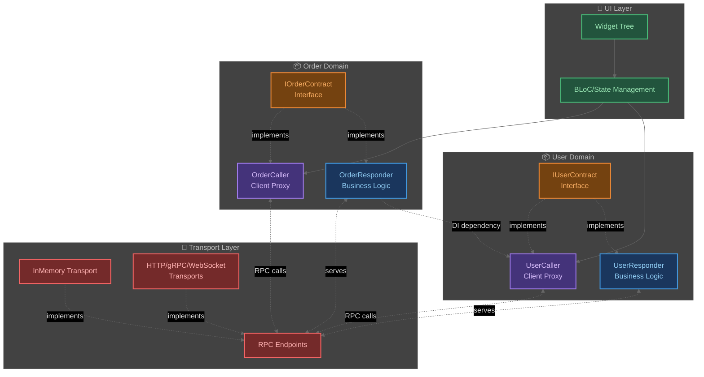
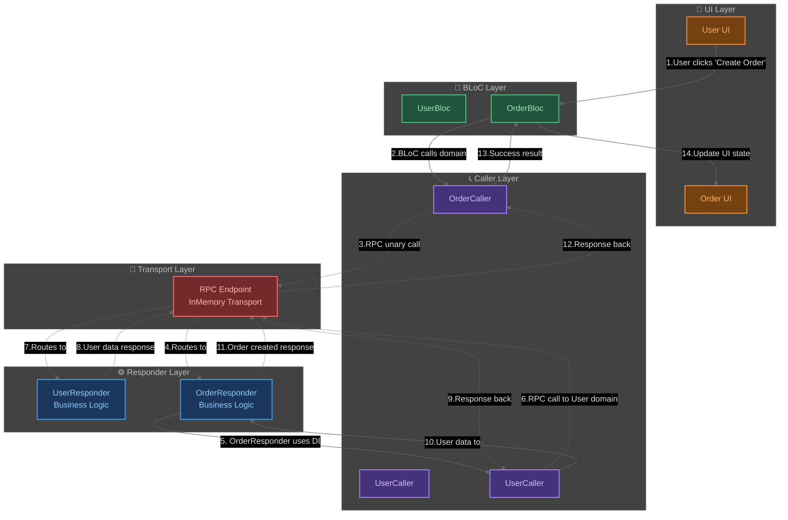

# CORD Architecture Overview

> **Contract-Oriented Remote Domains: Архитектурное руководство**

## Связанная документация

📖 **Смотри также:**
- [CORD Best Practices](cord_best_practices.md) — рекомендации по проектированию архитектуры
- [CORD General Practices](cord_general_practices.md) — практики программирования в CORD

## Содержание

1. [Введение](#введение)
2. [Архитектурная философия CORD](#архитектурная-философия-cord)
   - [Основная идея](#основная-идея)
   - [Ключевые принципы](#ключевые-принципы)
3. [Архитектурные компоненты CORD](#архитектурные-компоненты-cord)
   - [Contract (Контракт)](#1-contract-контракт)
   - [Responder (Реализация домена)](#2-responder-реализация-домена)
   - [Caller (Клиент домена)](#3-caller-клиент-домена)
4. [Транспортные механизмы](#транспортные-механизмы)
   - [InMemory Transport](#inmemory-transport)
   - [Другие транспорты](#другие-транспорты)
5. [Архитектурные паттерны CORD](#архитектурные-паттерны-cord)
6. [Фундаментальные свойства CORD](#фундаментальные-свойства-cord)
7. [Заключение](#заключение)
8. [Приложение A: Архитектурные диаграммы CORD](#приложение-a-архитектурные-диаграммы-cord)

---

## Введение

**CORD (Contract-Oriented Remote Domains)** — это архитектурный подход для структурирования сложных приложений через изоляцию доменов с формальными контрактами взаимодействия. CORD решает фундаментальную проблему роста сложности в больших системах: когда логика разных бизнес-областей смешивается, система становится непредсказуемой и хрупкой.

## Архитектурная философия CORD

### Основная идея
> **"Каждый домен — это автономный сервис, связанный с другими доменами через типизированные контракты"**

CORD меняет подход к архитектуре: вместо технической декомпозиции (UI → Business Logic → Data) предлагается **доменная декомпозиция**, где каждый домен функционирует как независимый сервис с четким API.

### Ключевые принципы

#### 1. Contract-Oriented (Контрактно-ориентированный)
Все взаимодействия между доменами происходят только через формальные типизированные контракты. Контракт определяет публичный API домена как набор типизированных операций, каждая из которых принимает Request объект и возвращает Response объект.

**Принципы контрактно-ориентированного подхода:**
- Явная типизация всех операций через Request/Response пары
- Формальное описание API домена через интерфейсы
- Возможность версионирования через семантические изменения контрактов
- Поддержка как унарных операций (запрос-ответ), так и потоковых (подписки на события)

#### 2. Remote (Удаленность)
Домены могут выполняться в любом контексте — от локального до распределенного. Архитектура CORD абстрагирует физическое расположение доменов, позволяя им взаимодействовать через единый интерфейс независимо от того, находятся ли они в одном процессе, разных процессах или на разных серверах.

**Принцип удаленности означает:**
- Домены не знают о физическом расположении других доменов
- Один и тот же код домена работает локально и распределенно
- Конфигурация транспорта определяет стратегию развертывания
- Возможность динамического изменения стратегии без изменения кода доменов

#### 3. Domains (Доменная структура)
Каждый домен отвечает за строго определенную бизнес-область и не зависит напрямую от других доменов.

## Архитектурные компоненты CORD

### 1. Contract (Контракт)

**Назначение:** Формальный API домена, определяющий все доступные операции.

Контракт определяет набор операций домена через типизированные методы с Request/Response объектами. Поддерживаются как унарные операции (запрос-ответ), так и потоковые операции (подписки на события).

**Характеристики контракта:**
- Типобезопасность через Request/Response объекты
- Поддержка унарных и потоковых операций
- Независимость от транспорта
- Версионирование через семантические изменения

### 2. Responder (Реализация домена)

**Назначение:** Содержит бизнес-логику домена и реализует контракт.

**Архитектурные принципы Responder:**
- **Единственная ответственность:** каждый Responder отвечает только за свой домен
- **Dependency Injection:** получает зависимости от других доменов через Caller'ы в конструкторе  
- **Изоляция логики:** содержит только бизнес-правила своего домена
- **Interdomain communication:** взаимодействует с другими доменами исключительно через RPC вызовы
- **Управление ресурсами:** инкапсулирует работу с локальными ресурсами (repository, cache, database)

### 3. Caller (Клиент домена)

**Назначение:** Предоставляет типобезопасный способ вызова методов домена.

**Архитектурные принципы Caller:**
- **Proxy pattern:** зеркальная реализация контракта для клиентской стороны
- **Transport abstraction:** инкапсулирует детали RPC вызовов и транспортного механизма
- **Compile-time safety:** обеспечивает типобезопасность на этапе компиляции
- **Transport agnostic:** работает с любым транспортным механизмом без изменения кода

> 📊 **Визуальное представление:** Архитектурные диаграммы CORD доступны в [Приложении A](#приложение-a-архитектурные-диаграммы-cord)

## Транспортные механизмы

### InMemory Transport
**Основной транспорт для большинства применений**

InMemory транспорт обеспечивает прямую связь между Caller'ами и Responder'ами в рамках одного процесса через механизм парных endpoints.

**Характеристики:**
- Задержка: ~0.1мс
- Накладные расходы: минимальные (только CBOR сериализация)
- Изоляция: процессная
- Надежность: высокая
- Применение: разработка, тестирование, production для большинства проектов

### Другие транспорты

Помимо InMemory транспорта, CORD поддерживает создание альтернативных транспортных механизмов через расширяемую архитектуру транспортного слоя.

**Концептуальные категории транспортов:**
- **Process isolation transports** — для изоляции доменов в отдельных процессах
- **Network transports** — для распределенного выполнения доменов
- **Streaming transports** — для real-time взаимодействия
- **Message queue transports** — для асинхронной коммуникации

**Архитектурные принципы транспортов:**
- **Pluggable architecture:** транспорты подключаются через конфигурацию endpoints
- **Domain code isolation:** код доменов остается неизменным при смене транспорта
- **Configuration-driven deployment:** стратегия развертывания определяется конфигурацией
- **Transport transparency:** детали транспортного механизма скрыты от доменной логики

## Архитектурные паттерны CORD

### Паттерн 1: Реактивное междоменное взаимодействие

Домены могут подписываться на события других доменов через потоковые RPC операции. Responder одного домена может инициализировать подписки на события других доменов при запуске, обеспечивая реактивную архитектуру без прямых зависимостей.

### Паттерн 2: UI координация через Caller

UI слой координирует выполнение бизнес-процессов, вызывая методы различных доменов в правильной последовательности. Каждый BLoC или другой UI-контроллер работает с несколькими Caller'ами для организации междоменных сценариев, сохраняя при этом четкую изоляцию доменной логики.

### Паттерн 3: Многоуровневая композиция доменов

Создание доменов высокого уровня, которые инкапсулируют сложные междоменные бизнес-процессы. Такие домены-оркестраторы координируют работу нескольких базовых доменов, предоставляя упрощенный API для сложных операций. Они обеспечивают централизованное управление транзакциями и обработку ошибок в распределенных сценариях.

## Фундаментальные свойства CORD

### Архитектурная гибкость
CORD обеспечивает возможность эволюции системы от монолитной к распределенной архитектуре без изменения доменного кода. Решения о физическом размещении доменов принимаются на уровне конфигурации, а не архитектуры.

### Предсказуемость взаимодействий
Все междоменные взаимодействия происходят через формальные контракты, что делает поведение системы явным и предсказуемым. Побочные эффекты контролируются через явные RPC вызовы.

### Изоляция доменов
Каждый домен функционирует как автономный сервис с четко определенными границами. Внутренние изменения в одном домене не влияют на другие домены, если контракт остается неизменным.

### Типобезопасность
Все междоменные взаимодействия типизированы на уровне компилятора, что предотвращает ошибки несовместимости интерфейсов и упрощает рефакторинг.

## Заключение

**CORD** представляет собой мощный архитектурный подход, который обеспечивает:

- **Четкую изоляцию доменов** через формальные контракты
- **Гибкость развертывания** от монолита до микросервисов
- **Типобезопасность** всех междоменных взаимодействий
- **Простоту тестирования** каждого домена в изоляции
- **Масштабируемость команд** через независимое развитие доменов

CORD особенно эффективен для больших приложений с сложной доменной логикой, где важна архитектурная гибкость и предсказуемость развития системы.

*"Архитектура — это то, что остается неизменным при изменении требований. CORD делает границы доменов архитектурной константой."* 

## Приложение A: Архитектурные диаграммы CORD

<h3>📊 Структурная диаграмма архитектуры</h3>

**Описание:** Показывает статическую структуру CORD архитектуры — компоненты, слои и их взаимосвязи.

<h3>🔄 Диаграмма взаимодействия (Flow)</h3>

**Описание:** Демонстрирует пошаговое взаимодействие в типичном сценарии "создание заказа с междоменным взаимодействием".

**🔢 Пошаговый flow:**

**Этап 1-4: Инициация запроса**
1. **User action** → пользователь нажимает "Create Order"
2. **UI → BLoC** → UI передает событие в BLoC
3. **BLoC → Caller** → BLoC вызывает OrderCaller
4. **RPC → Responder** → Transport маршрутизирует к OrderResponder

**Этап 5-10: Междоменное взаимодействие**  
5. **DI injection** → OrderResponder использует UserCaller
6. **Cross-domain RPC** → UserCaller вызывает User домен
7. **Route to User** → Transport направляет к UserResponder
8. **User response** → UserResponder возвращает данные
9. **Response back** → Transport возвращает ответ UserCaller'у
10. **Data to Order** → UserCaller передает данные OrderResponder'у

**Этап 11-14: Завершение операции**
11. **Order response** → OrderResponder возвращает результат
12. **RPC response** → Transport возвращает ответ OrderCaller'у  
13. **Success to BLoC** → OrderCaller передает результат BLoC'у
14. **Update UI** → BLoC обновляет состояние UI

<h3>📖 Справочная информация по диаграммам</h3>

**🏗️ Структурная диаграмма** показывает:
- **Архитектурные слои** и их компоненты
- **Статические связи** между компонентами
- **Dependency Injection** паттерны  
- **Contract implementations** (интерфейс → реализации)

**🔄 Flow диаграмма** показывает:
- **Динамическое взаимодействие** в конкретном сценарии
- **Пошаговый поток** выполнения операции  
- **RPC вызовы** между доменами
- **Жизненный цикл** запроса от UI до ответа

**🔗 Типы связей:**
- **Сплошные стрелки** (→) — прямые зависимости и поток данных
- **Пунктирные стрелки** (-..->) — реализация интерфейсов и RPC вызовы
- **Двунаправленные** (↔) — bidirectional RPC соединения

**📦 Слои архитектуры:**
- **UI Layer** — BLoC/State Management работает только с Caller'ами
- **Domain Layers** — изолированные домены с тройкой Contract-Responder-Caller
- **Transport Layer** — гибкий транспортный механизм

**🎯 Архитектурные принципы:**
- UI никогда не обращается к Responder'ам напрямую
- Междоменное взаимодействие только через Caller'ы  
- Один транспортный слой для всех доменов
- Код доменов не зависит от выбора транспорта

 